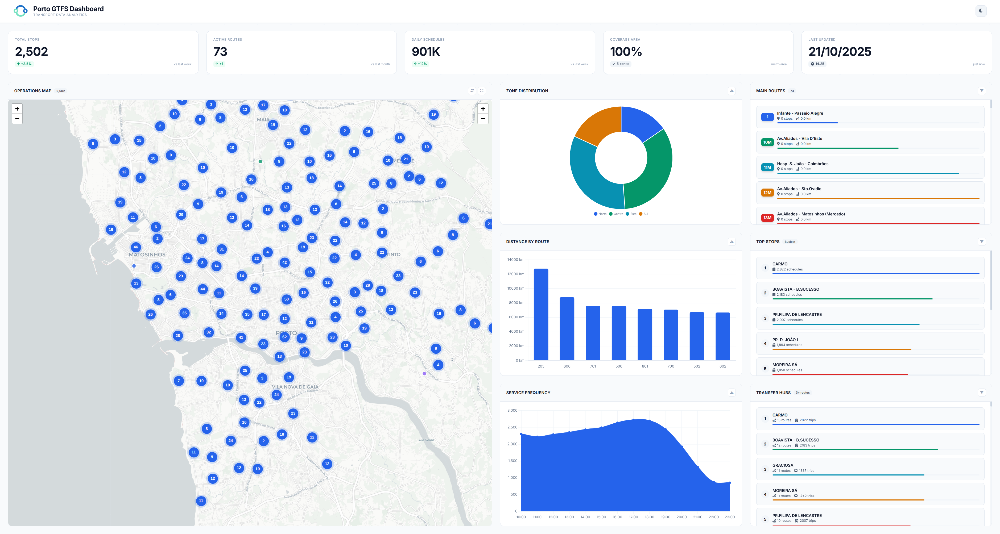

# GTFS ETL Pipeline



This project is a way to fetch public transport data from Porto (STCP), clean it up, and serve it in a useful and visual way. Every day, it downloads schedules, stops, and routes, processes everything, and feeds a fresh dashboard and API.

Currently, the system tracks **2,502 stops**, **73 routes**, and **901,089 schedules**.

## How It Works

The process is a classic data pipeline (ETL), orchestrated to run automatically:

1.  **Extract:** Every day, the system fetches the latest data in GTFS format from the [Porto Open Data Portal](https://opendata.porto.digital/).
2.  **Transform:** The raw data is processed and organized. We create a database that separates the original data (`raw`) from the processed data ready for analysis (`analytics`). It's at this stage that we calculate metrics like the busiest stops or the main transfer hubs.
3.  **Load (and Expose):** The transformed data is made available in two ways:
    *   A **REST API**, so that any other application can consume this data.
    *   A **Web Dashboard**, which uses the API to display the information graphically and intuitively.

## The Toolbox

To build this, we used a set of well-known technologies:

*   **Core Language:** Python 3.x
*   **Pipeline Orchestration:** Prefect
*   **Database:** PostgreSQL 16
*   **API:** FastAPI
*   **Data Manipulation:** Pandas
*   **Web Server:** Nginx
*   **Containerization:** Docker Compose

## Quick Start

The easiest way to get this running is with Docker.

```bash
git clone https://github.com/dapovoa/github/gtfs-etl-pipeline
cd gtfs-etl-pipeline
./deploy/docker/deploy.sh
```

The script takes care of everything: it starts the services and runs the initial pipeline. The first time, it might take a few minutes.

When it's done, you can access the application at `http://localhost`. The API documentation is available at `http://localhost/api/docs`.

## Deployment Options

The project was designed to be flexible when it comes to deployment:

*   **[Docker](deploy/docker/README.md):** The recommended option for development and testing. A single command and it's up and running.
*   **[Bare Metal](deploy/bare-metal/README.md):** For those who prefer a manual installation on a Linux server, with full control.
*   **[AWS Lightsail](deploy/aws-lightsail/README.md):** A production-ready cloud deployment, automated with Terraform and Ansible.

## Project Structure

The file organization follows a logic of separation of concerns:

```
gtfs-etl-pipeline/
  src/                # The application's source code
    main_pipeline.py  # The main ETL orchestrator
    api_server.py     # The API server
    pipelines/        # Scripts to process each GTFS file
    sql/              # Scripts to create tables and views in the DB
    dashboard/        # The web dashboard files
  deploy/             # Deployment scripts and configurations
    docker/
    bare-metal/
    aws-lightsail/
  nginx/              # Nginx configurations
  README.md
```

## Data Source

The data is obtained in GTFS format. For more details on the specification, you can consult the [official GTFS website](https://gtfs.org/schedule/).

## License

This project is under the MIT License. See the [LICENSE](LICENSE) file for details.
