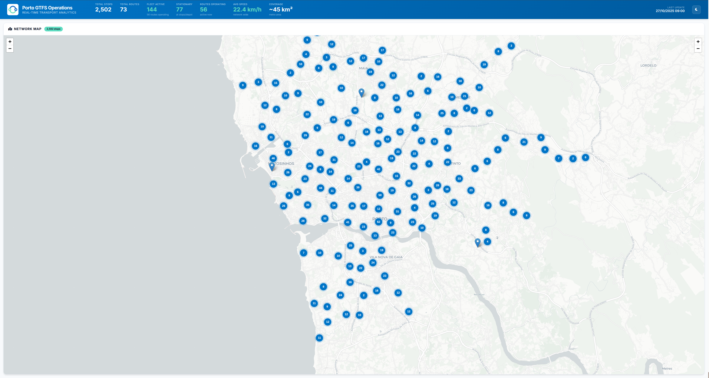

# STCP GTFS ETL Pipeline



## About this Project

This is an automated system that collects, processes and presents public transport information from STCP (Sociedade de Transportes Coletivos do Porto) in a database and web dashboard. The system downloads daily official schedule and route data from STCP, processes and organizes this data in a PostgreSQL database, and creates a web panel with public transport statistics and maps.

Key capabilities include monitoring transport operations (2,502 stops, 73 routes, 901,089 schedules), visualizing routes on Porto's map, analyzing service frequencies and zone distribution, and identifying main stops and transport connections. The system runs automatically daily and is accessible via web dashboard.

## Features

- Automated GTFS data download and processing
- Real-time dashboard with transport metrics
- Interactive map visualization
- Route and stop analysis
- Service frequency monitoring
- Containerized deployment with Docker support

## Installation

# SETUP STCP - Prefect Stack

## Prerequisites

**PostgreSQL Driver for Windows Power BI:**  
https://www.postgresql.org/ftp/odbc/releases/

## DB-SERVER Setup

### 1. Linux Hardening

```bash
sudo visudo
```
Add: `Defaults timestamp_timeout=-1`

```bash
sudo apt update -y && sudo apt upgrade -y
sudo ufw allow openssh && sudo ufw --force enable
```

### 2. SSH Configuration

```bash
sudo nano /etc/ssh/sshd_config
```
Set: `PasswordAuthentication no`

```bash
sudo systemctl restart ssh
sudo ufw default deny incoming
sudo ufw default allow outgoing
sudo ufw allow 22/tcp
sudo ufw --force enable
sudo apt install -y fail2ban
```

### 3. PostgreSQL Installation

```bash
sudo apt install curl ca-certificates
sudo install -d /usr/share/postgresql-common/pgdg
sudo curl -o /usr/share/postgresql-common/pgdg/apt.postgresql.org.asc --fail https://www.postgresql.org/media/keys/ACCC4CF8.asc
```

```bash
. /etc/os-release
sudo sh -c "echo 'deb [signed-by=/usr/share/postgresql-common/pgdg/apt.postgresql.org.asc] https://apt.postgresql.org/pub/repos/apt $VERSION_CODENAME-pgdg main' > /etc/apt/sources.list.d/pgdg.list"
```

```bash
sudo apt update -y && sudo apt install -y postgresql-16
```

### 4. PostgreSQL Configuration

```bash
sudo nano /etc/postgresql/16/main/postgresql.conf
```
Configure:
```
listen_addresses = '<your-db-server-ip>, localhost'
ssl = on
```

### 5. Remote Access Configuration

```bash
sudo nano /etc/postgresql/16/main/pg_hba.conf
```
Add: `host all all <your-network-subnet>/24 scram-sha-256`

### 6. Start PostgreSQL Service

```bash
sudo systemctl start postgresql@16-main
sudo systemctl enable postgresql@16-main
sudo systemctl restart postgresql
```

### 7. Database Setup

```bash
sudo -u postgres psql
```

**Create database and user:**
```sql
CREATE USER etl_user WITH PASSWORD '<your-secure-password>';
CREATE DATABASE stcp_warehouse;
GRANT ALL PRIVILEGES ON DATABASE stcp_warehouse TO etl_user;

\c stcp_warehouse

CREATE SCHEMA raw;
CREATE SCHEMA staging;
CREATE SCHEMA analytics;

GRANT ALL ON SCHEMA raw TO etl_user;
GRANT ALL ON SCHEMA staging TO etl_user;
GRANT ALL ON SCHEMA analytics TO etl_user;

ALTER DEFAULT PRIVILEGES IN SCHEMA raw GRANT ALL ON TABLES TO etl_user;
ALTER DEFAULT PRIVILEGES IN SCHEMA raw GRANT ALL ON SEQUENCES TO etl_user;

ALTER DEFAULT PRIVILEGES IN SCHEMA staging GRANT ALL ON TABLES TO etl_user;
ALTER DEFAULT PRIVILEGES IN SCHEMA staging GRANT ALL ON SEQUENCES TO etl_user;

ALTER DEFAULT PRIVILEGES IN SCHEMA analytics GRANT ALL ON TABLES TO etl_user;
ALTER DEFAULT PRIVILEGES IN SCHEMA analytics GRANT ALL ON SEQUENCES TO etl_user;

\q
```

## ETL-SERVER Setup

### 1. Linux Hardening

```bash
sudo visudo
```
Add: `Defaults timestamp_timeout=-1`

```bash
sudo apt update -y && sudo apt upgrade -y
sudo ufw allow openssh && sudo ufw --force enable
```

### 2. SSH Configuration

```bash
sudo nano /etc/ssh/sshd_config
```
Set: `PasswordAuthentication no`

```bash
sudo systemctl restart ssh
sudo ufw default deny incoming
sudo ufw default allow outgoing
sudo ufw allow 22/tcp
sudo ufw --force enable
```

### 3. Install Dependencies

```bash
sudo apt update && sudo apt install -y python3-venv python3-pip postgresql-client-16
```

### 4. Python Environment Setup

```bash
python3 -m venv ~/prefect-env
source ~/prefect-env/bin/activate
pip install --upgrade pip
```

### 5. Project Setup

```bash
git clone <your-repository-url> ~/src
cd ~/src
pip install -r requirements.txt
```

### 6. Environment Configuration

Set the required environment variables as documented in the main README.md file before running the application.

### 7. Systemd Services

**Prefect Server Service:**
```bash
sudo nano /etc/systemd/system/prefect-server.service
```

```ini
[Unit]
Description=Prefect Server
After=network.target

[Service]
Type=simple
User=<your-username>
Group=<your-username>
WorkingDirectory=/home/<your-username>/src
Environment=PATH=/home/<your-username>/prefect-env/bin
Environment=DB_USER=etl_user
Environment=DB_PASSWORD=<your-db-password>
Environment=DB_HOST=<your-db-host>
Environment=DB_NAME=stcp_warehouse
ExecStart=/home/<your-username>/prefect-env/bin/prefect server start --host <your-etl-server-ip> --port 4200
Restart=always
RestartSec=10

[Install]
WantedBy=multi-user.target
```

**STCP API Service:**
```bash
sudo nano /etc/systemd/system/stcp-api.service
```

```ini
[Unit]
Description=STCP API Server
After=network.target

[Service]
Type=simple
User=<your-username>
Group=<your-username>
WorkingDirectory=/home/<your-username>/src
Environment=PATH=/home/<your-username>/prefect-env/bin
Environment=DB_USER=etl_user
Environment=DB_PASSWORD=<your-db-password>
Environment=DB_HOST=<your-db-host>
Environment=DB_NAME=stcp_warehouse
ExecStart=/home/<your-username>/prefect-env/bin/uvicorn api_server:app --host 127.0.0.1 --port 8000
Restart=always
RestartSec=5

[Install]
WantedBy=multi-user.target
```

### 8. Enable and Start Services

```bash
sudo systemctl daemon-reload
sudo systemctl enable prefect-server.service
sudo systemctl enable stcp-api.service
sudo systemctl start prefect-server.service
sudo systemctl start stcp-api.service
```

### 9. Verify Services

```bash
sudo systemctl status prefect-server.service
sudo systemctl status stcp-api.service
```

### 10. Initial Pipeline Test

```bash
cd ~/src
python main_pipeline.py
```

## Nginx Web Server Setup

### 1. Install Nginx

```bash
sudo apt update && sudo apt install -y nginx
```

### 2. Create Dashboard Configuration

```bash
sudo nano /etc/nginx/sites-available/stcp-dashboard
```

```nginx
server {
    listen 80;
    server_name <your-server-domain-or-ip>;

    root /var/www/html/stcp-dashboard;
    index index.html;

    location / {
        try_files $uri $uri/ =404;
    }

    location /api {
        proxy_pass http://127.0.0.1:8000/api;
        proxy_set_header Host $host;
        proxy_set_header X-Real-IP $remote_addr;
        proxy_set_header X-Forwarded-For $proxy_add_x_forwarded_for;
        proxy_set_header X-Forwarded-Proto $scheme;
    }
}
```

### 3. Enable Configuration

```bash
sudo ln -s /etc/nginx/sites-available/stcp-dashboard /etc/nginx/sites-enabled/
sudo nginx -t
sudo systemctl restart nginx
sudo ufw allow 'Nginx Full'
```

### 4. Deploy Dashboard

```bash
sudo cp -r ~/src/dashboard /var/www/html/stcp-dashboard
sudo chown -R www-data:www-data /var/www/html/stcp-dashboard
sudo nginx -t
sudo systemctl restart nginx
```

## Automation Setup

### 1. Configure Automatic Updates

```bash
chmod +x ~/src/check_and_update.py
```

### 2. Setup Cron Job

```bash
EDITOR=nano crontab -e
```

Add daily execution at 06:00:
```cron
0 6 * * * cd ~/src && source ~/prefect-env/bin/activate && DB_USER=etl_user DB_PASSWORD=<your-db-password> DB_HOST=<your-db-host> DB_NAME=stcp_warehouse python check_and_update.py >> /var/log/stcp-update.log 2>&1
```

### 3. Initial Test

```bash
cd ~/src
python check_and_update.py
```

## Docker Deployment

For containerized deployment with Docker, see [docker/README.md](docker/README.md).

## Configuration

The application uses environment variables for configuration:

### Environment Variables:
- `DB_PASSWORD`: Database password (default: `DbServer123`, **should be changed for production**)

### Optional Variables (with defaults):
- `DB_USER`: Database username (default: `etl_user`)
- `DB_HOST`: Database hostname/IP (default: `127.0.0.1`)
- `DB_PORT`: Database port (default: `5432`)
- `DB_NAME`: Database name (default: `stcp_warehouse`)
- `DATA_BASE_PATH`: Directory for storing GTFS data files (default: `data`)
- `ZIP_FILE_NAME`: Name for the GTFS zip file (default: `gtfs_data.zip`)

### Security Best Practices:
- Never commit passwords to version control
- Use strong, unique passwords for production
- See [SECURITY.md](SECURITY.md) for complete security guidelines

This is a reference implementation - fork and adapt as needed.
